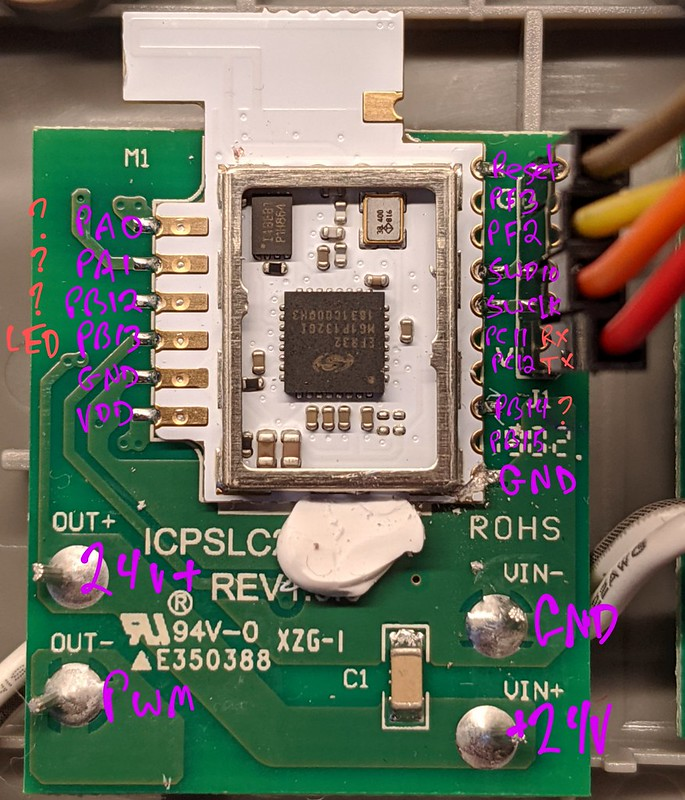

# The Micropython port for the Silcon Labs EFM32

This port of Micropython runs in the Gecko boards used in the Ikea
Tradfri lighting hardware and should be portable to other Silican Labs
EFM32 boards.

The one used for most of the testing is the LED 10W dimmer shown above,
which has the Gecko board as a module inside the case as well as easy to
access SWD pins for reprogramming.  The console pins require soldering
extra jumpers.

# EFM32 features

Datasheet for the [EFR32MG1P132G1](https://www.silabs.com/documents/public/data-sheets/efr32mg1-datasheet.pdf)
used in the Ikea devices.  QFN48 package, 256 KB of internal flash, 32 KB of internal RAM, external SPI flash
for storing OTA images or other things.

* [Gecko SDK](https://github.com/SiliconLabs/Gecko_SDK)
* [SDK documentation](https://siliconlabs.github.io/Gecko_SDK_Doc/)

## Supported features
* It boots!
* The REPL reads and writes to the serial port
* The radio module can send and receive 802.15.4 packets
* Frozen modules work -- add files into the `modules` directory to bundle them into the image
* ZigBee messages are parsed in Python [`modules/IEEE802154.py`](modules/IEEE802154.py)
* GPIO (partially; need to adapt the real MicroPython pins)

## Not yet supported
* Interrupting the REPL
* Over the air updates to the frozen modules
* Zigbee OTA
* Bluetooth LE
* Thread?
* External SPI flash
* Self programming
* PWM

# No Warranty!

This is very beta and likely voids your Ikea warranty.

# Building for an EFM32 MCU

For the first build it is necessary to build the `mpy-cross` directory
so that frozen MicroPython files can be created:

	make -C ../../mpy-cross

The `Makefile` is setup to build for the EFR32MG1P cpu and enables a UART
for communication.  To build in this directory:

	make

This version of the build should work out-of-the-box on a Ikea 10w LED dimmer (and
anything similar), and will give you a MicroPython REPL on UART1 at 115200
baud (output on PB14, input on PB15).

The high-current LED driver is on pin PB13.

SWD is on PF1(SWCLK) and PF0(SWD).  Installation is easiest with OpenOCD or
similar SWD probe.

# RAIL

The RAIL library overrides some interrupts, which are marked as `weak` in startup code:
* ` RFSENSE_IRQHandler`
* ` AGC_IRQHandler`
* ` BUFC_IRQHandler`
* ` FRC_IRQHandler`
* ` FRC_PRI_IRQHandler`
* ` MODEM_IRQHandler`
* ` PROTIMER_IRQHandler`
* ` RAC_RSM_IRQHandler`
* ` RAC_SEQ_IRQHandler`
* ` SYNTH_IRQHandler`

There is a Python interface to the EFM32 radio module in [`radio.c`](radio.c) that provides a few methods:

* `Radio.init()`
* `Radio.promiscuous(bool)`
* `Radio.rx()` -- returns `ByteArray` of packet or `None` if no packets are waiting
* `Radio.tx(bytes)` -- transmits a raw packet; the user must fill in all of the headers, although the radio adds the FCS
* `Radio.address(nwk_addr, pan_id)` -- configures the short address and PAN ID for non-promiscuous reception


# Licensing

Micropython is redistributed under a MIT license.  See [`../../LICENSE`](../../LICENSE)
for the contents.

The `emlib` and `gecko_sdk` directories are copyright Silicon Laboratories
and are redistributed under a modified 3-clause BSD license:

```
Copyright 2016 Silicon Laboratories, Inc. http://www.silabs.com

 * Permission is granted to anyone to use this software for any purpose,
 * including commercial applications, and to alter it and redistribute it
 * freely, subject to the following restrictions:
 *
 * 1. The origin of this software must not be misrepresented; you must not
 *    claim that you wrote the original software.
 * 2. Altered source versions must be plainly marked as such, and must not be
 *    misrepresented as being the original software.
 * 3. This notice may not be removed or altered from any source distribution.
```

The `startup_efr32mg1p.c` and `system_efr32mg1p.c` files are
copyright ARM Limited and are redistributed under an unmodified 3-clause BSD license:

```
   Copyright (c) 2011 - 2014 ARM LIMITED

   All rights reserved.
   Redistribution and use in source and binary forms, with or without
   modification, are permitted provided that the following conditions are met:
   - Redistributions of source code must retain the above copyright
     notice, this list of conditions and the following disclaimer.
   - Redistributions in binary form must reproduce the above copyright
     notice, this list of conditions and the following disclaimer in the
     documentation and/or other materials provided with the distribution.
   - Neither the name of ARM nor the names of its contributors may be used
     to endorse or promote products derived from this software without
     specific prior written permission.
```

The RAIL RF modem library has its own license in [`rail/Silabs_License_Agreement.txt`](rail/Silabs_License_Agreement.txt).
